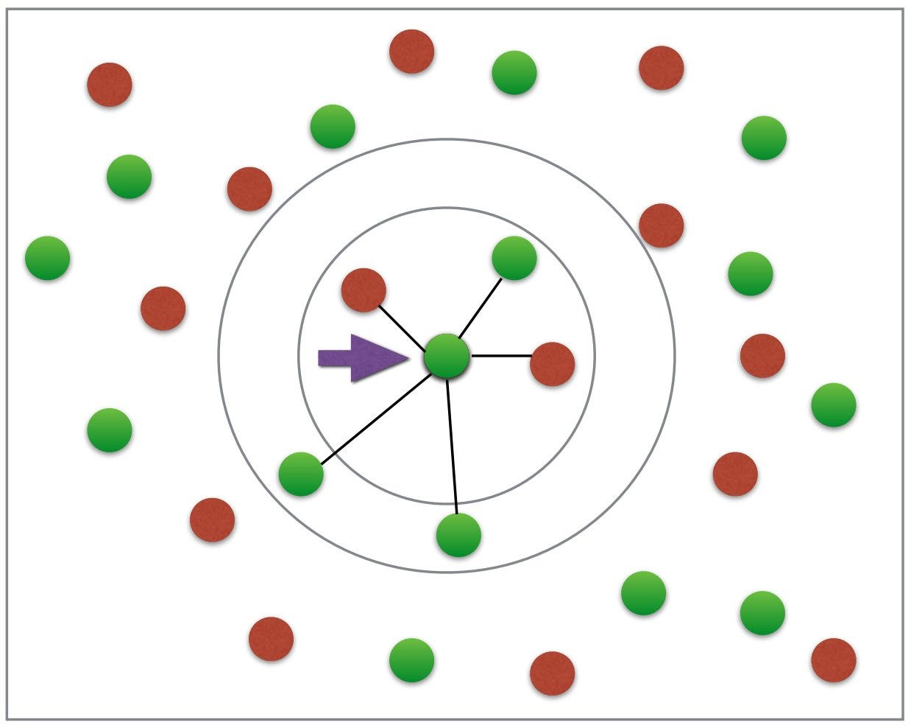

# Book Recomendations

This project is part of the Free Code Camp Machine Learning course. The goal of the project was to build a book recommendations model using KNN. The model receives the book's name as input and returns the best 5 recommendations for it. This was achieved using `NearestNeighbors` from the **Sklearn library**.

  

